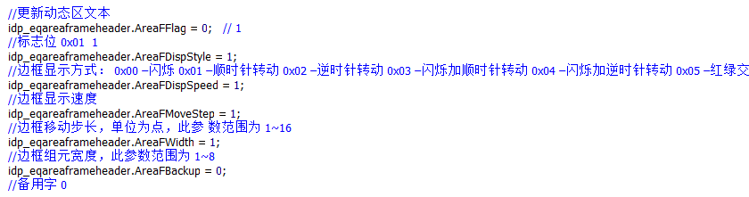

#  BX-G5/G6 SDK 动态区接口调用说明PowerBuilder

## 文档适用者

通过SDK向仰邦控制卡发送显示内容的软件开发者；

本文档主要描述5代控制卡和6代控制卡的动态区的SDK接口使用；


## 动态区接口的使用

### 5代卡的动态区使用步骤

#### 5代卡动态区接口介绍

1. 发送一条文本信息到指定的动态区

2. 发送一个图片到指定的动态区

3. 增加多条信息（文本/图片）到指定的动态区，并可以关联这个动态区到指定的节目

4. 删除动态区：

   - 删除单个动态区

   - 删除多个动态区

*如果每次向相同ID的动态区中发送信息，则动态区只会显示最近一次发送的内容；


#### 动态区接口调用步骤

以 发送一条文本信息到指定的动态区 为例：

##### 步骤：

###### 0.初始化SDK库：只需要初始化一次;

###### 1.声明PB格式的函数及数据结构；

###### 2.调用函数：bxDual_dynamicArea_AddAreaWithTxt_point_5G；

###### 3.释放SDK库：与初始化SDK库一一对应；


##### 代码示例：

###### 初始化SDK库：只需要初始化一次;

```
/*初始化SDK库：linux平台不需要此步骤；windows平台需要；只需要初始化一次；*/
integer nInit = bxDual_InitSdk(); //返回0成功；-1失败；
```


###### 声明PB格式的函数及数据结构

- 函数声明

```powerb
//函数声明：
Function long bxDual_dynamicArea_AddAreaWithTxt_point_5G(string pIP, unsignedlong nPort,unsignedlong color,byte uAreaId,byte RunMode,unsignedinteger Timeout,byte RelateAllPro,unsignedinteger RelateProNum,unsignedlong RelateProSerial,byte ImmePlay,unsignedinteger uAreaX, unsignedinteger uAreaY, unsignedinteger uWidth,unsignedinteger uHeight, ref dp_eqareaframeheader oFrame,byte DisplayMode,byte ClearMode,byte Speed,unsignedinteger StayTime,byte RepeatTime, ref dp_eqfontdata oFont,string fontName,string strAreaTxtContent) Library "bx_sdk_dual.dll"  alias for "bxDual_dynamicArea_AddAreaWithTxt_5G;Ansi"
```


- 数据结构定义格式及赋值

  ```
  global type dp_eqareaframeheader from structure
  	byte		areafflag
  	byte		areafdispstyle
  	byte		areafdispspeed
  	byte		areafmovestep
  	byte		areafwidth
  	byte		areafbackup
  end type
  ```




###### 调用动态区接口函数

```c++

/*
功能说明：增加一条文件信息到指定的动态区，并可以关联这个动态区到指定的节目；
参数说明：strAreaTxtContent - 动态区域内要显示的文本内容
*/
//函数调用
ll_error = bxDual_dynamicArea_AddAreaWithTxt_point_5G(ls_ip, ll_port,1,0,0,9,1,0, 0  ,1,0, 0, 96,48, idp_eqareaframeheader,3,0,9,9,0,idp_eqfontdata,ls_fontName,ls_string1)

```

###### 释放SDK库：与初始化SDK库一一对应；

```
/*释放SDK库：与初始化SDK库一一对应；linux下不需要*/
bxDual_ReleaseSdk();
```

